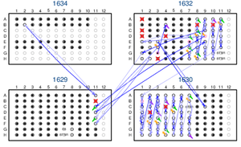

  

      <ul class="nav">
      <!--    <li><a href="{{ BASE_PATH }}/assets/broman.pdf">cv</a></li>  -->
          <li><a href="https://github.com/diptavo">github</a></li>
	  <li><a href="https://scholar.google.com/citations?user=0HmuYCUAAAAJ&hl=en">Google Scholar</a></li>
          <li><a href="https://twitter.com/Diptavo">@Diptavo</a></li>
      </ul>
  

<table class="wide">
<tr>
<td class="left">
    
</td>
<td class="left">
 <b> Diptavo Dutta </b>
  Postdoctoral Fellow
  Departments of Biostatistics & Biomedical Engineering
  Jonhs Hopkins University
 
  <b> Research Interest </b>: Statistical Genetics, GWAS,
                   eQTL, multi-omics, Mixed Models,
                   Quasi-likelihood models, Factor models.
  

</td>
</tr>
</table>

## News

- **Nov, 2021** Research on Proteome-wide association studies accepted in *Nature Genetics*.

- **Sept, 2021** [Preprint](https://www.medrxiv.org/content/10.1101/2021.08.29.21262811v1) on identifying genes associated with different breast cancer outcomes, regulated by copy number aberrations.  

- **Sept, 2021** Collaborative [article](https://jasn.asnjournals.org/content/32/9/2291) on proteins associated with risk of kidney function decline now published in *JASN*

- **Aug, 2021** Collaborative [article](https://journals.lww.com/fpmrs/Abstract/2021/08000/Genome_Wide_Association_Study_of_Pelvic_Organ.7.aspx) on GWAS of Pelvic Organ Prolapse Using the Michigan Genomics Initiative published in Female Pelvic Medicine & Reconstructive Surgery

-  **March, 2021** Preprint on Proteome-wide association models is out on [medRXiv](https://www.biorxiv.org/content/10.1101/2021.03.15.435533v1.abstract)

- **March, 2021** Initial version of the Shiny application on visualizing cis-associations and fine-mapping results of 2,000 proteins is released. [Check it out !](http://nilanjanchatterjeelab.org/pwas/)

- **January, 2021** Article on gene-set association analysis (GAUSS) accepted in *AJHG*
  
  
  
  
##### Email: <diptavo21@jhu.edu> or <ddutta4@jhmi.edu>

<!--

<table class="wide">
<tr>
  <td class="left">
    
  </td>
  <td class="right">
    
  </td>
</tr>
<tr>
  <td class="left">
    
  </td>
  <td class="right">
    
  </td>
</tr>
</table>

  

      <ul class="nav">
          <li><a href="morefigs.html">see more figures</a></li>
      </ul>
  

-->
