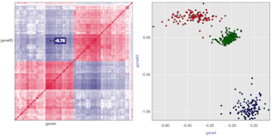
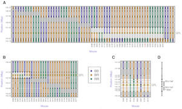

  

      <ul class="nav">
      <!--    <li><a href="{{ BASE_PATH }}/assets/broman.pdf">cv</a></li>  -->
          <li><a href="https://github.com/diptavo">GitHub</a></li>
	  <li><a href="https://scholar.google.com/citations?user=0HmuYCUAAAAJ&hl=en">Google Scholar</a></li>
          <li><a href="https://twitter.com/Diptavo">@Diptavo</a></li>
      </ul>
  

<table class="wide">
<tr>
<td class="left">
    
</td>
<td class="left">
 <b> Diptavo Dutta </b>
  Earl Stadtman Tenure Track Investigator
  Integrative Tumor Epidemiology Branch
  Division of Cancer Epidemiology and Genetics
  National Cancer Institute
 
  <b> Research Interest </b>: Statistical Genetics, GWAS,
                   eQTL, multi-omics, Mixed Models,
                   Quasi-likelihood models, Functional Genomics.
  

</td>
</tr>
</table>

## Announcements

- I am seeking a motivated postdoc candidate to join my lab. Research projects are available on diverse projects, including disease genetics, genetics of molecular phenotypes and rare variation analysis. **Email me** at: <diptavo.dutta@nih.gov> with a current CV, including publications and research experience. Diverse quantitative expertise will be considered, from machine learning methods to statistical genetics and bioinformatics.

## News

- **Apr, 2024** [Research article](https://www.sciencedirect.com/science/article/pii/S2666247724000228?via%3Dihub) on subset based meta analysis for cross-tissue transcriptome-wide association studies is published in HGG Advances.

- **Jul, 2023** [Resarch article](https://www.sciencedirect.com/science/article/pii/S030228382302780X) on the largest till date GWAS of bladder cancer, led by [Dr. Stella Koutros](https://dceg.cancer.gov/about/staff-directory/koutros-stella) published in European Urology.

- **Jan, 2023** [Preprint](https://www.medrxiv.org/content/10.1101/2023.01.11.23284454v1) on subset based meta analysis for cross-tissue transcriptome-wide association studies led by [Xinyu (Brian) Guo](https://www.brian-guo.com/) is now available online. 

- **Dec, 2022** [Research article](https://journals.plos.org/plosone/article?id=10.1371/journal.pone.0276886) on association of copy number variations and gene expressions in context of breast cancer related outcomes, published in *Plos One*.

  
  
  
  
##### Email: <diptavo.dutta@nih.gov> or <dutta.diptavo@gmail.com>

<!--

<table class="wide">
<tr>
  <td class="left">
    
  </td>
  <td class="right">
    
  </td>
</tr>
<tr>
  <td class="left">
    
  </td>
  <td class="right">
    
  </td>
</tr>
</table>

  

      <ul class="nav">
          <li><a href="morefigs.html">see more figures</a></li>
      </ul>
  

-->
