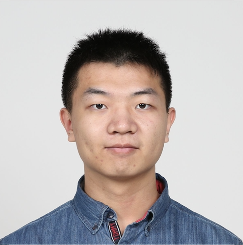
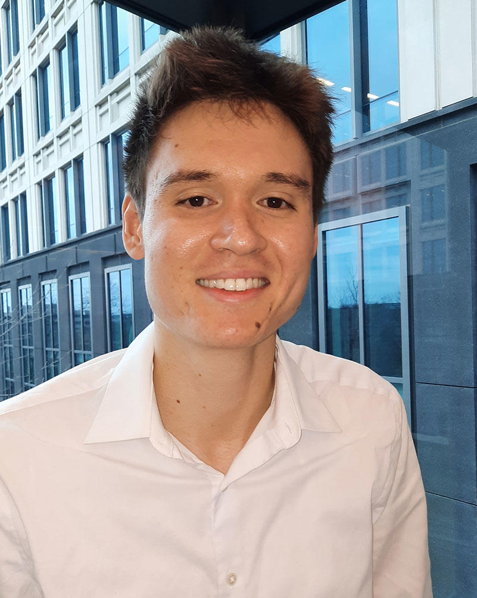

<table class="wide">
<tr>
  <td class="left">
      
  </td>
  <td class="right">
  
  <a href="publpics/XG.html"> <b>Xinyu (Brian) Guo</b></a>   
  <b> Ph.D. candidate, University of Southern California </b>  
 
 </td>
 </tr>
##### Contact Email: <xyguo1202@gmail.com>

<table class="wide">
<tr>
  <td class="left">
      
  </td>
  <td class="right">
  
  <a href="publpics/OBJ.html"> <b>Om B. Jahagirdar </b></a>   
 <b> Research Analyst, ITEB, DCEG, NCI </b>  
 
 </td>
 </tr>

 
<tr>
  <td class="left">
      
  </td>
  <td class="right">
  
 <a href="publpics/KW.html"> <b>Kevin Wang</b></a>  
 <b> Postbaccalaureate Fellow, ITEB, DCEG, NCI </b>  
 
 </td>
 </tr>

