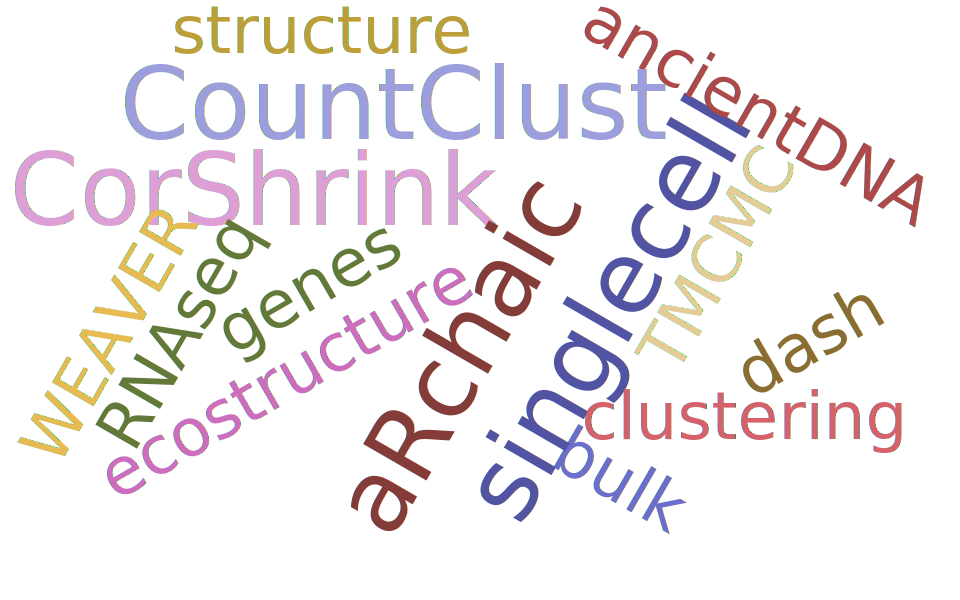

I am a <b>Postdoctoral Fellow</b> (2019 - Present) in <a href="https://www.jhsph.edu/departments/biostatistics/">Departments of Biostatistics</a> & <a href="https://www.bme.jhu.edu/">Biomedical Engineering</a> at the Bloomberg School of Public Health, <a href="https://www.jhu.edu/">Johns Hopkins University</a>. My advisors are <a href="https://www.jhsph.edu/faculty/directory/profile/1826/nilanjan-chatterjee">Nilanjan Chatterjee</a>  and <a href="https://www.bme.jhu.edu/people/faculty/alexis-battle">Alexis Battle</a>. I also collaborate closely with faculty from Department of Epidemiology and School of Medicine at JHU. My research interests lie in novel statistical methodologies for broad applications in Statistical Genetics, Genome-wide Association Studies (GWAS), Transcriptomics and Proteomics, Multi-Omics Data Integration and Disease Risk Prediction. See my Research Interests and <a href="https://diptavo.github.io/pages/pubs.html"> recent publications</a> for more information on my current and past work.

I earned my <b>Ph.D. in Biostatistics</b> in 2019 from the <a href="https://sph.umich.edu/biostat/">Department of Biostatistics</a>, <a href="https://umich.edu/">University of Michigan</a>, Ann Arbor, under the supervision of <a href="https://sph.umich.edu/faculty-profiles/lee-seunggeun.html">Seunggeun (Shawn) Lee</a>. In my <a href="https://diptavo.github.io/pages/pubs.html#dissertation">Ph.D. thesis</a> titled "Statistical Methods for Gene-based and Gene-Set Analysis", I worked on novel statistical methods for identifying pleiotropic rare variants and associations of pathways with diseases. My dissertation work led to <b>3 publications</b> in <i>Genetic Epidemiology</i> and <i>The American Journal of Human Genetics</i>.  Additionally, as a member of the Center for Statistical Genetics, I have worked closely with <a href="https://sph.umich.edu/faculty-profiles/boehnke-michael.html">Michael Boehnke</a>, <a href="https://sph.umich.edu/faculty-profiles/scott-laura.html">Laura Scott</a> and <a href="https://sph.umich.edu/faculty-profiles/sen-ananda.html">Ananda Sen</a>. 

Before my doctoral studies, I earned a <b>Masters in Statistics (M.Stat)</b> in 2014 from the <a href="https://www.isical.ac.in/">Indian Statistical Institute</a> with Biostatistics and Data analysis specialization and <b>B.Sc Statistics Honors</b> in 2012 from St. Xavier's College, University of Calcutta.

### Resume

You can find my current CV here. 

<!--

<td class="left">
    
</td>

-->

<h4>Contact</h4>

    

        

           Diptavo Dutta 
            <a href="https://www.jhsph.edu/departments/biostatistics/">Department of Biostatistics</a> 
            Bloomberg School of Public Health 
            Johns Hopkins University 
            615 N Wolfe Street, E3001 
            Baltimore, MD 21205 
            USA 
	    Email: diptavo21@jhu.edu, dutta.diptavo@gmail.com 
        

    

