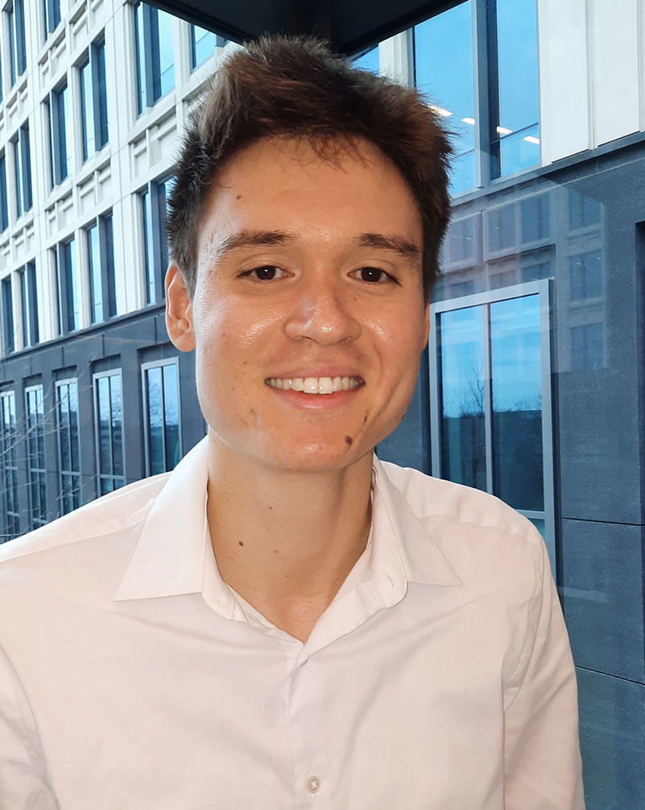

  

## Eductaion
Kevin received his M.S. in statistics from University of Chicago in 2023, where he focused on machine learning and biostatistics. In 2020, he received his bachelor’s degree from the University of Illinois at Urbana-Champaign.

## Research
Kevin’s current research focuses on methodology in statistical genetics, with a concentration on rare-variant and variant-set analysis in connection to integrative omics for cancer studies. He is interested in how statistics can be applied to problems in genetics, medicine, and public health (is this too broad?).

## Interests
In his free time, Kevin enjoys playing tennis, volleyball, and hiking.

