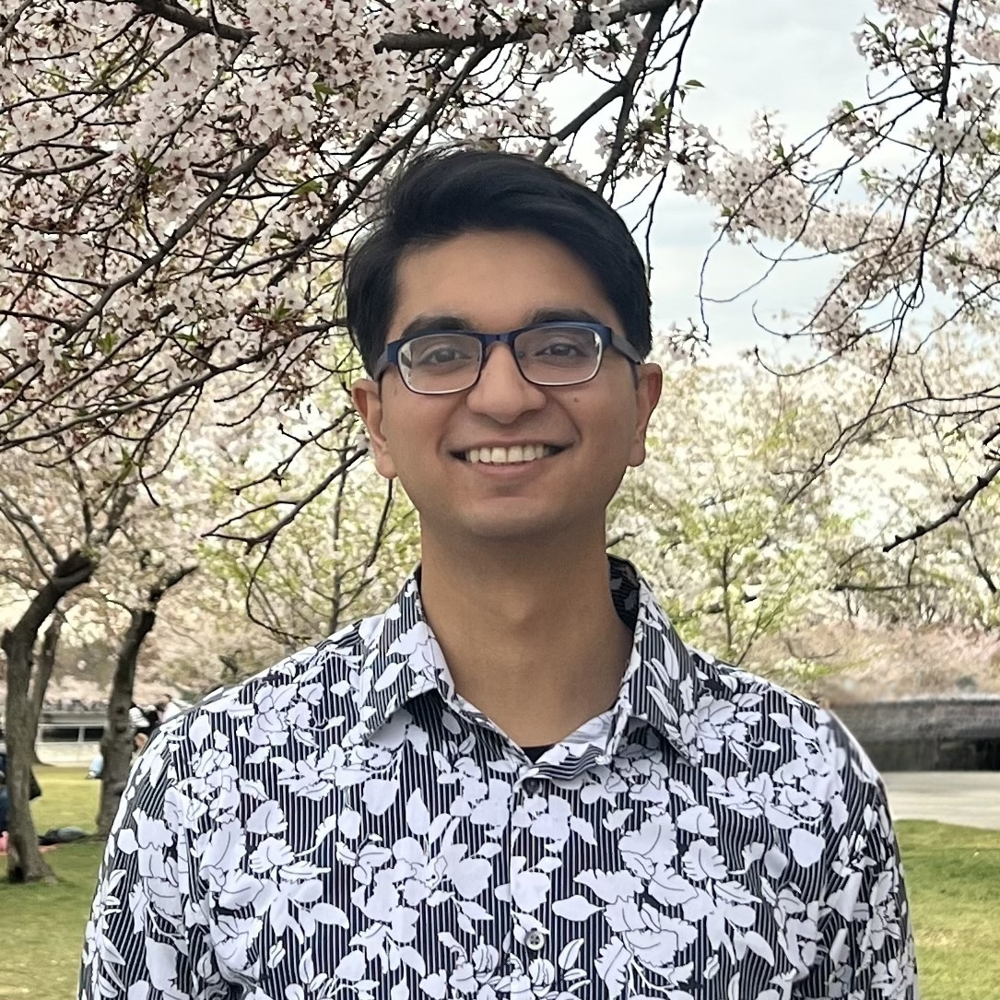

  

## Eductaion
In 2023, Om graduated from Stanford University with departmental honors and distinction, completing his B.S. in Biomedical Computation with a focus in organ systems. During his senior year, he concurrently completed his M.S. in Computer Science at Stanford with a focus in artificial intelligence.

## Research
Om is passionate about applying technology, particularly AI/informatics, to enhance global health equity. He has accomplished research projects utilizing data science and machine learning for various applications including biomedical imaging tumor segmentation, 3D motif annotation in proteins, disease risk assessment from natural language clinical notes, and novel PPE use in global settings. Om received the Firestone Medal for his honors thesis investigating genetic-cultural co-evolution, finding novel genomic signals across global populations for conditions including gastric cancer and kidney disease. In the Dutta Lab, he is applying these experiences to develop computational pipelines, analyze international -omic databases across tissues, and investigate cancer etiologies across diverse, historically-underserved ancestries.

## Interests
Om’s passion for global health extends outside medical research. He is founder of the nonprofit Omnisight International, which empowers communities through providing free eye care and health education to underserved children and families in low-resource regions of the world. He also loves comedy and served as the managing humor editor for the Stanford Daily for three volumes. He enjoys playing soccer and tennis, and he has developed a newfound appreciation for history and art while exploring the numerous museums and galleries in DC.

