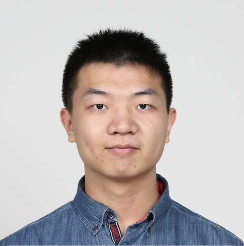

  

## Eductaion
Xinyu (Brian) Guo’s academic foundation includes a B.A. in Math and CS from Washington University in St. Louis, an ScM in Biostatistics from JHU, and is currently advancing towards a PhD in Computational Biology at USC.

## Research
His research mainly focused on statistical genetics and genomics, specifically in spatial transcriptomics, next generation sequencing, and cancer epigenetics. He is also interested in applying statistical learning and AI techniques to understand genetic/genomic variations and their impact on health and disease.

## Interests
Outside of academia, he has a passion for basketball, photography, and diving.

## Contact

##### Email: Xinyu Guo: <xyguo1202@gmail.com>

