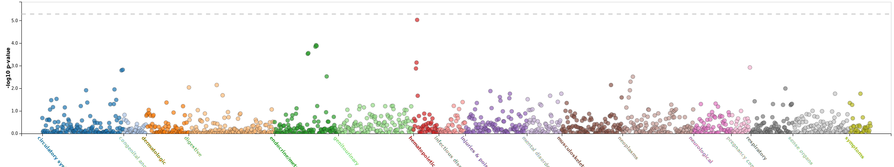
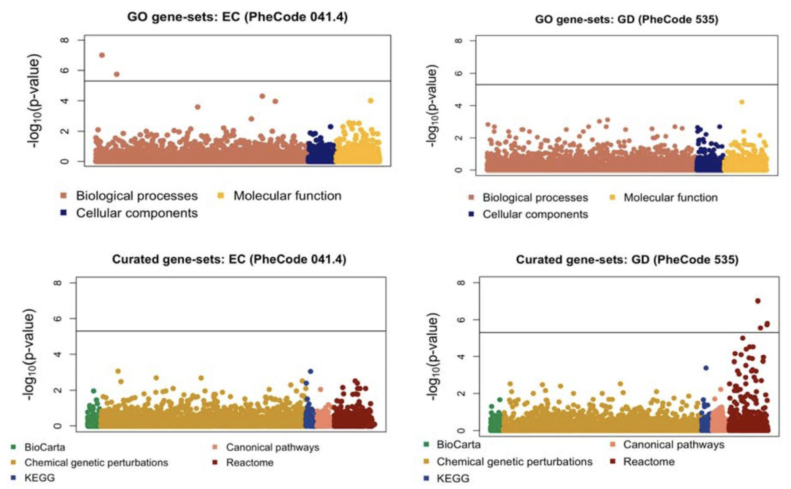

  

      <ul class="nav">
          <li><a href="pqtl.html">Previous Topic</a></li>
          <li><a href="causal.html">Next Topic</a></li>
      </ul>
  

  

 
With rapid advancements in technologies, genetic studies of different traits and diseases are growing exponentially. Newer statistical and computational tools are required for efficient and sound analysis of such unprecedented scale of data. One of the most popular areas of research is identifying associations of traits and diseases with rare variants. I have developed <a href="https://onlinelibrary.wiley.com/doi/abs/10.1002/gepi.22156">variance component tests for testing cross-phenotype associations of rare variants</a> and for <a href="https://onlinelibrary.wiley.com/doi/abs/10.1002/gepi.22248">meta-analyzing</a> such results across studies. Additionally I have developed a <a href="https://www.sciencedirect.com/science/article/pii/S0002929721000586">novel subset-based method</a> to identify pathways associated to diseases and detect which genes are "activated" within the associated pathway. Such tools can be used as an effective followup of GWAS results. Beyond these, I am interested in a large spectrum of statistical methods to address different questions arising out of such large-scale genetic association studies. For example, the GWAS pipelines usually employ mixed models based association tests. But for binary or survival outcomes, the covariance model imposed through genetic relatedness matrix is usually misspecified. We have developed a corrected covariance model, which reduces model misspecification, is computationally efficient and produces interpretable parameter estimates. However, still a large array of research questions exist, including fine-mapping, cross-ancestry fine mapping, cross-phenotype TWAS analysis, identifying active tissues and many more. See more in <a href="https://diptavo.github.io/pages/pubs.html"><b>Publications</b></a>.
 

  

