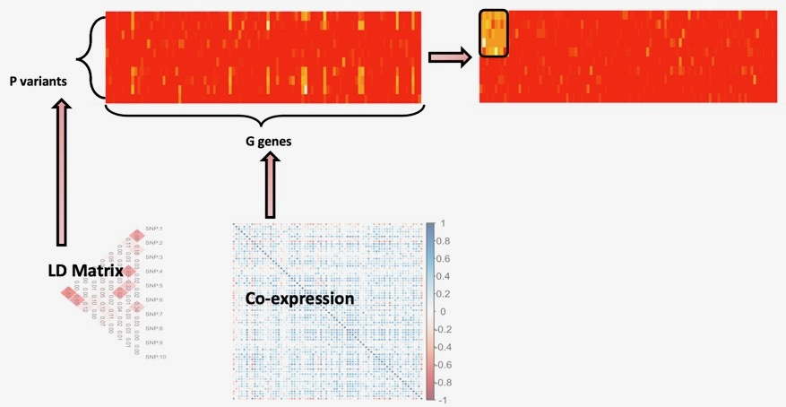
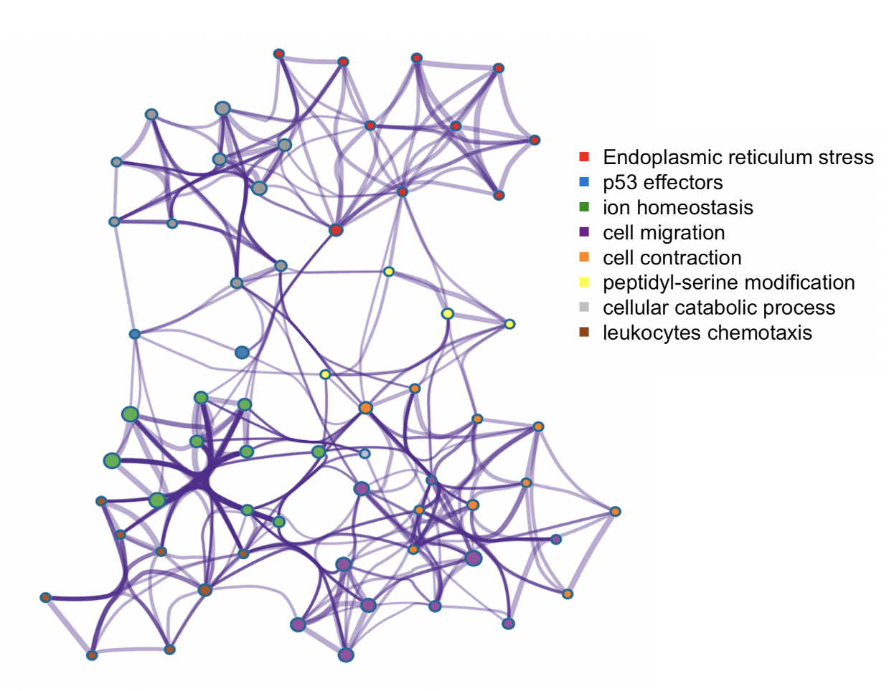

  

      <ul class="nav">
          <li><a href="rqtlexper_fig1.html">prev</a></li>
          <li><a href="rqtlexper_fig2.html">next</a></li>
      </ul>
  

  

 
<i>Trans</i>-regulation of molecular phenotypes like gene-expression levels, protein levels, metabolites and others can provide key insights into causal mechanisms and pathways underlying complex diseases and traits. In general, <i>trans</i>-associations of variants associated to different traits, can highlight the key gene-sets and pathways involved in the genetic etiology of the trait in question. However, standard trans-mapping methods suffer from low statistical power due to high multiple testing burden and weaker effect sizes. To identify *trans*-targets of known trait-related variants, we employed a sparse canonical correlation based approach, named <a href="https://www.medrxiv.org/content/10.1101/2020.09.29.20204388v2.full-text"><b>ARCHIE</b></a>, which identifies gene-sets that are <i>trans</i>-regulated by sets of trait-related variants. This is particularly suitable for interpretation, since the identified gene-sets would represent major biological mechanisms via which the effects of the variants are cascaded. Applications of this method on summary statistics from <i>trans</i>-eQTL mapping in eQTLGen consortium, showed that the genes identified were indeed enriched in relevant pathways, transcription factor targets and <i>trans</i>-heritability. This approach, is further generalizable to any molecular phenotypes to detect broad regulation patterns. We are currently applying such methods to detect <i>trans</i>-regulation of plasma proteins by trait-related variants, regulation of gene-expression by copy number aberrations and their effect on cancer-related outcomes. With further generalizations into tensor decompositions and/or factor analysis, this can broadly be extend into multi-view data which will be critical in analyzing multi-omics data.  See more in <a href="https://diptavo.github.io/pages/pubs.html"><b>Publications</b></a>.
 

 

