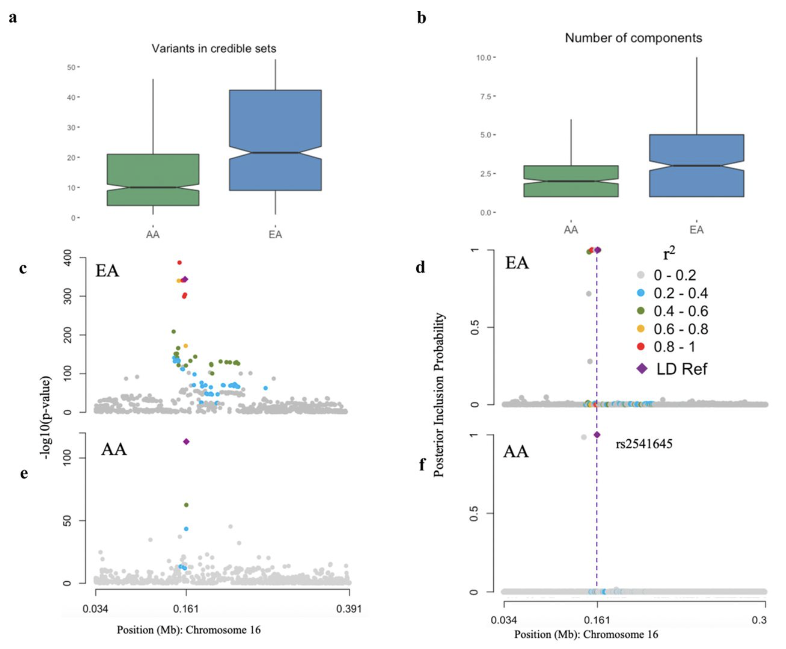
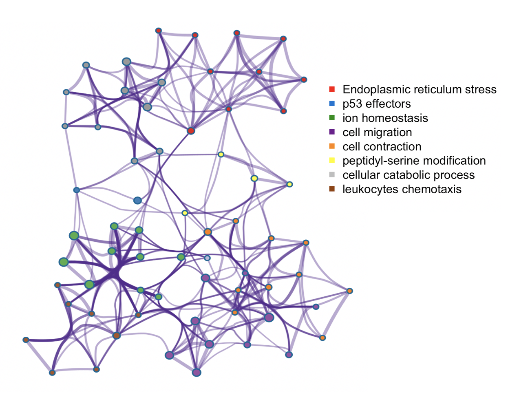
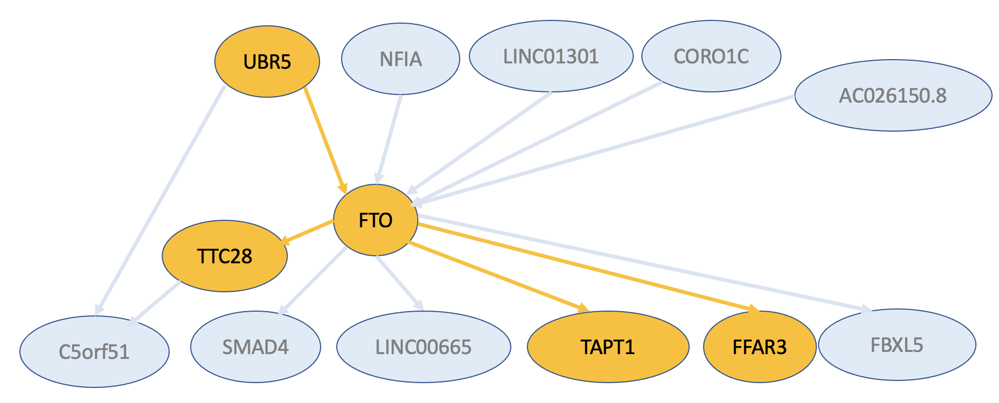

<table class="wide">
<tr>
     <td class="left">
         
  </td>
  <td class="right">
    
 	<b> Methods for Genetic Association Tests </b>  
 	<a href="publpics/scca.html"> <b>Read more</b></a>
 	
   </td>
</tr>

<tr>
  <td class="left">
      
  </td>
  <td class="right">
  
 <b> Protein Quantitative Trait Loci (pQTL)</b>  
 <a href="publpics/scca.html"> <b>Read more</b></a>
 
  </td>
 </tr>
 
 
 <tr>
  <td class="left">
      
  </td>
  <td class="right">
  
 <b> Trait-related Trans-regulation Patterns</b> 
 <a href="publpics/scca.html"> <b>Read more</b></a>
 
  </td>
 </tr>

 <tr>
  <td class="left">
      
  </td>
  <td class="right">
  
 <b> Causal Genetic Networks for Diseases</b>  
 <a href="publpics/scca.html"> <b>Read more</b></a>
 
  </td>
 </tr>

 
</table>

  

      <ul class="nav">
          <li><a href="morefigs.html">see more figures</a></li>
      </ul>
  

