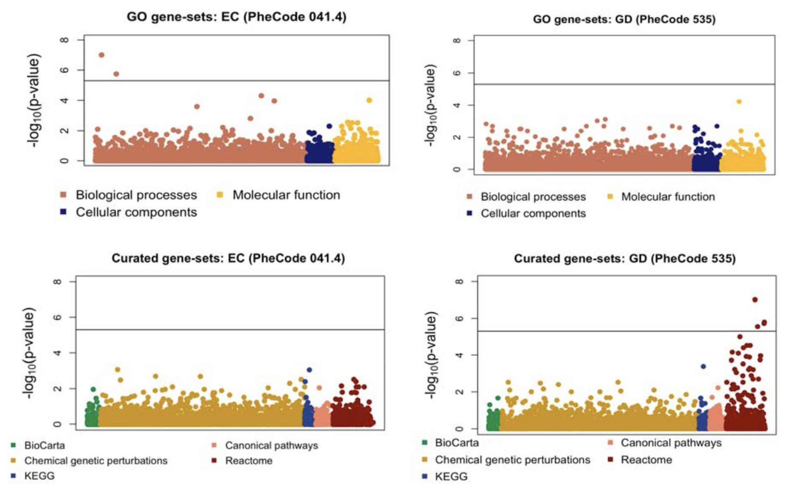

<table class="wide">
<tr>
  <td class="left">
      
  </td>
  <td class="right">
  	<a href="publpics/scca.html"> Protein Quantitative Trait Loci</a>
  </td>
 </tr>
 <tr>
  <td class="left">
    <a href="publpics/scca.html"> Pathway-based Association Tests </a> 
   </td>
   <td class="left">
    
  </td>
</tr>
<tr>
  <td class="left">
    
  </td>
  <td class="right">
    
  </td>
</tr>
</table>

  

      <ul class="nav">
          <li><a href="morefigs.html">see more figures</a></li>
      </ul>
  

